# Image Classification using AWS SageMaker

In this project, I used AWS Sagemaker to train a pretrained model that can perform image classification by using the Sagemaker profiling, debugger, hyperparameter tuning and other good ML engineering practices.


# Project Schema

```
aws-ml-image-classification/
|----LICENSE.txt
|----README.md
|----hpo.py
|----inference.py
|----train_and_deploy.ipynb
|----train_model.py
|
|----test-photos-of-dogs/
|    |----dog1.png
|    |----dog2.jpg
|    |----dog3.jpg
|    |----dog4.jpg
|    |----dog5.jpeg
|    |----dog6.jpg
|    |----dog7.png
|
|----screenshots/
|    |----alljobs.png
|    |----besttrainingjob.png
|    |----endpoint_deployed.png
|    |----hyperparameter_jobs.png
|    |----infojob1.png
|    |----infojob2.png
|    |----infojob3.png
|    |----training_jobs.png
|    |----trial_screenshot.png
|
|----ProfilerReport/
|    |----profiler-output/
|        |----profiler-report.html
|        |----profiler-report.ipynb
|
|----results_inference/
     |----predicted_Alaskan_malamute_dog6.jpg
     |----predicted_American_eskimo_dog_dog2.jpg
     |----predicted_Bernese_mountain_dog_dog4.jpg
     |----predicted_Cane_corso_dog7.png
     |----predicted_German_shepherd_dog_dog5.jpeg
     |----predicted_Golden_retriever_dog1.png
     |----predicted_Golden_retriever_dog3.jpg
```


## Project Set Up and Installation

- Login in AWS and open SageMaker Studio. 
- Create an instance notebook using <code>ml.t3.medium</code> instance and <code>Pythorch 2.0.0 Python CPU Optimized</code> image.
- Upload the necessary files of the project in order to run our project:
    - <code>hpo.py:</code> script to train the model for hyperparamenter tuning
    - <code>train_model.py:</code> script to train model using debugging and profiling hooks
    - <code>inference.py:</code> script to deploy and inference
    - <code>train_deploy.ipynb:</code> main notebook to download our data and make all the process for our project
    - [OPTIONAL] <code>test-photos-of-dogs</code> folder contains random pictures of dogs in order to inference the deployed model
    - [OPTIONAL] <code>results_inference</code> will contain the results of there predictions


## Dataset
The provided dataset is the dogbreed classification dataset which can be downloaded clicking [here](https://s3-us-west-1.amazonaws.com/udacity-aind/dog-project/dogImages.zip).
Our dataset comprises images that represent 133 distinct dog breeds. The breeds range from the widely recognized, such as the Labrador Retriever and the German Shepherd, to the more unique breeds like the Norwegian Buhund and the Plott. 

Once the data is downloaded, it will be already split in three subfolders (<code>train, test and valid</code>) in order to create our model.
 

## Hyperparameter Tuning

For our project we user a Base Model <code>ResNet50</code>, a powerful convolutional neural network sourced form the <code>torchvisivion</code> library.

Chosen Hyperparameters

- **Learning rate (lr):** Determines step size during optimization. High values can overshoot; low values can slow training.
- **Bratch size:** Number of samples per weight update. Bigger batches are more stable but may generalize less effectively.
- **Epochs:** Times the model sees the entire dataset. More epochs can improve learning but risk overfitting.


Values for experimenting

| Hyperparameter | Values             |
|----------------|----------------------------|
| lr             | 0.001 to 0.1               |
| batch size     | 32, 64, 128                |
| epochs         | 1, 2                       |


Our tunning job consisted in 3 training jobs using a <code>ml.c5.2xlarge</code> instance and choosing as a metric the Average Test Loss (AVG Test loss). 


Best Hyperparameters after tunning

| Hyperparameter | Tuned Value                |
|----------------|----------------------------|
| lr             | 0.0010152583471663874      |
| batch size     | 64                         |
| epochs         | 2                          |


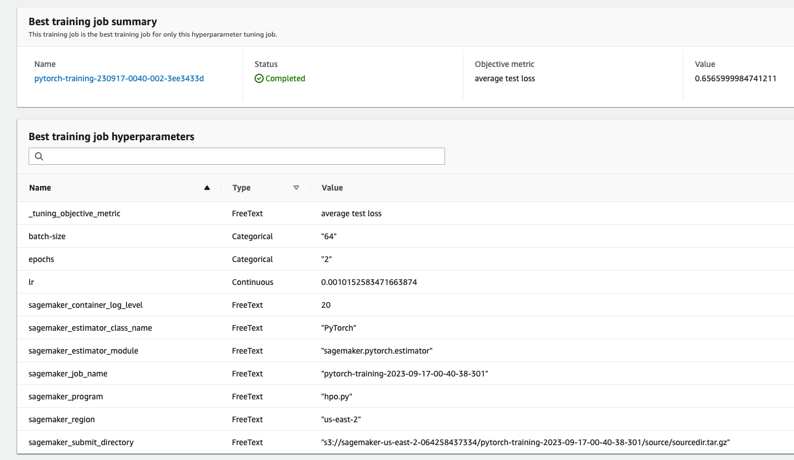


### Screenshots

**Hyperparameter tunning job**

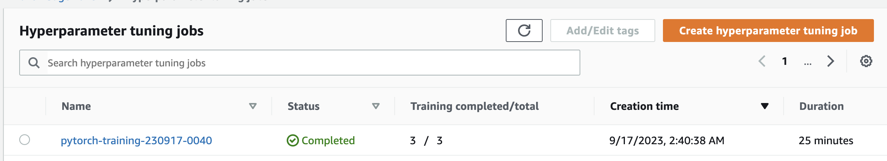

**Completed training jobs (3)**


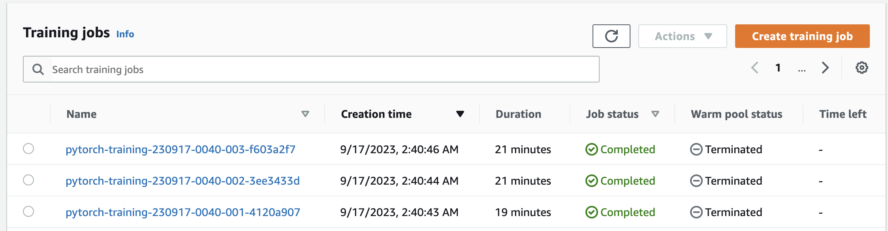


**Metric logs during training process (3)**

**1. First Training Job:  pytorch-training-230917-0040-001-4120a907**

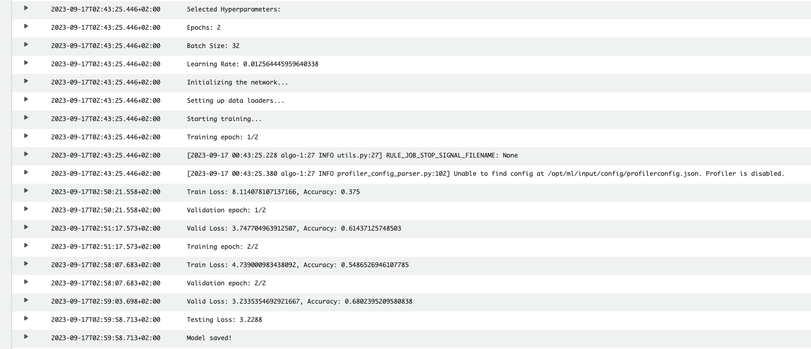


**2. Second Training Job:  pytorch-training-230917-0040-002-3ee3433d**

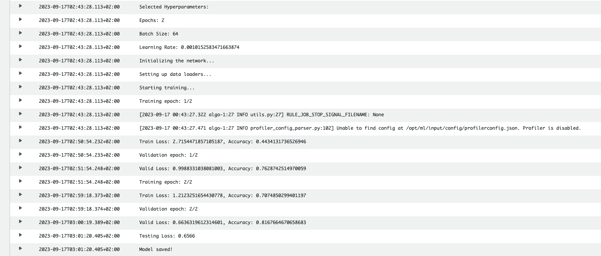

**3. Third Training Job:  pytorch-training-230917-0040-003-f603a2f7**


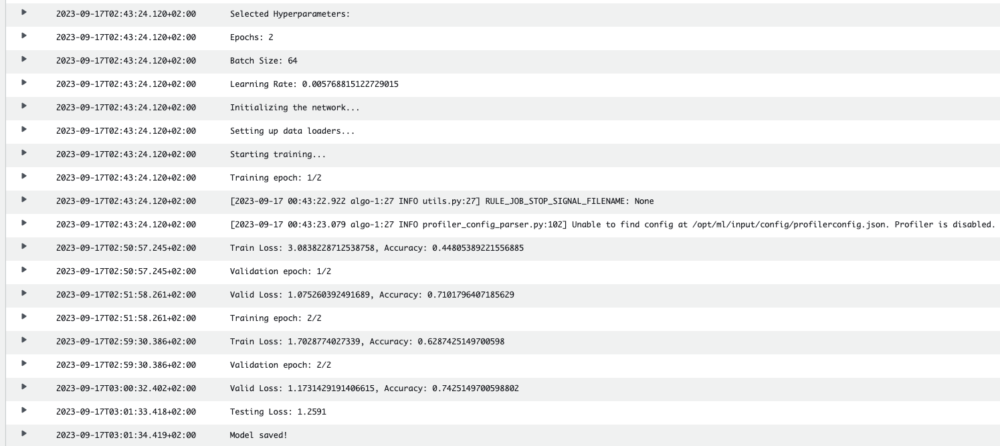

**Best Hyperparameters - Training Jobs Summary**


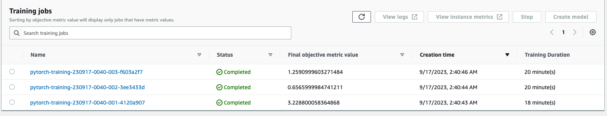


## Debugging and Profiling

- Profiler Rules were set up to monitor the model's performance, particularly looking for instances when the loss isn't decreasing.

```python
rules = [ 
    Rule.sagemaker(rule_configs.loss_not_decreasing()),
    ProfilerRule.sagemaker(rule_configs.ProfilerReport())]

```
- Debugger Collections captured key metrics like weights, gradients, biases, and the CrossEntropyLoss output during training and evaluation.
```python
debugging_collections = [
    CollectionConfig(
        name="model_weights",
        parameters={
            "train.save_interval": "5",
            "eval.save_interval": "1"
        }
    ),
    CollectionConfig(
        name="model_gradients",
        parameters={
            "train.save_interval": "5",
            "eval.save_interval": "1"
        }
    ),
    CollectionConfig(
        name="biases_values",
        parameters={
            "train.save_interval": "5",
            "eval.save_interval": "1"
        }
    ),
    CollectionConfig(
        name="LossOutput", 
        parameters={
            "include_regex": "CrossEntropyLoss_output_0",
            "train.save_interval": "1",
            "eval.save_interval": "1"
        }
    )
]

```

A Profiler Configuration collected system and framework metrics at regular intervals.


```python
profiling_configuration = ProfilerConfig(system_monitor_interval_millis=500,
                                         framework_profile_params=FrameworkProfile())

```

The report in HTML format is included in <code>ProfilerReport</code>.


### Results

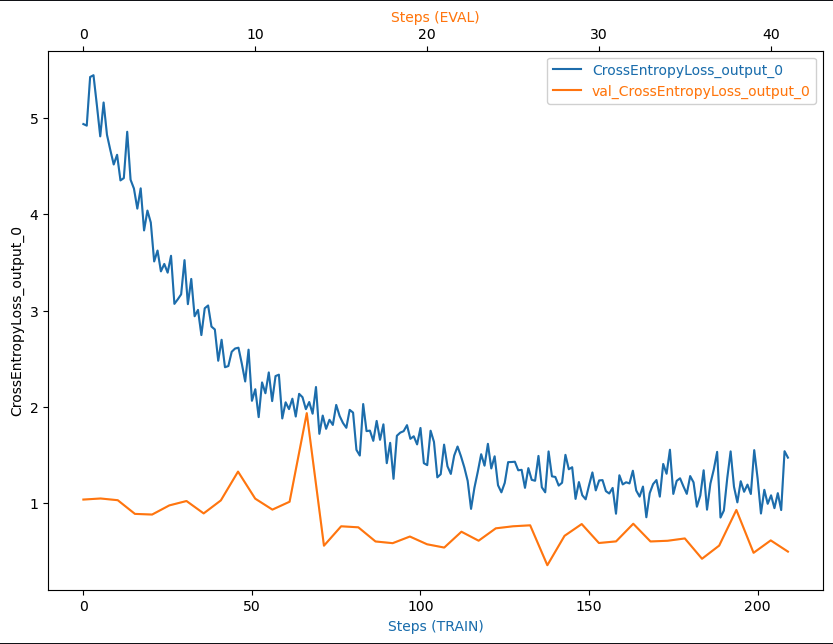


**Insights**

- Training loss decline significally from 5 to 1.9, indicating effective learning and fitting to the training data through the steps.
- However, training loss is noisy, suggesting potential improvements with a larger batch size.
- The validation loss starts low and remains relatively steady, hinting at a potential overfitting issue as it's consistently lower than the training loss.


**Improvements**

- Introducing regularization techniques can help mitigate overfitting.
- Augmenting the dataset or acquiring more data might provide a more generalized performance.


## Model Deployment

The deployed model is attached from <code>Debugging-Image-Classification-2023-09-17-11-28-25-671</code> and is based on the PyTorch framework, <code>ResNet50</code>:

```python
estimator = PyTorch.attach('Debugging-Image-Classification-2023-09-17-11-28-25-671')

model_path = "s3://sagemaker-us-east-2-064258437334/Debugging-Image-Classification-2023-09-17-11-28-25-671/output/model.tar.gz"

pytorch_model = PyTorchModel(
    entry_point="inference.py",
    model_data=model_path, 
    role=role, 
    framework_version="1.8",
    py_version="py36"
)


predictor = pytorch_model.deploy(initial_instance_count=1, instance_type="ml.m5.large")


```

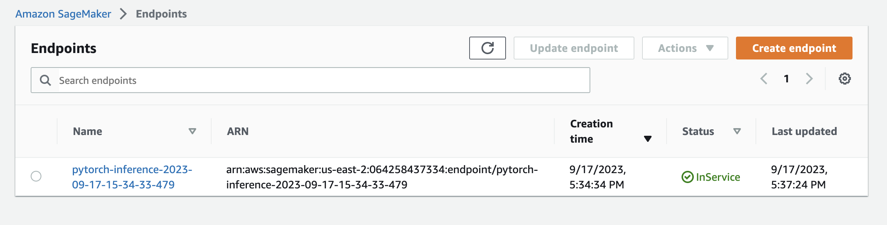


- The model processes an image and returns arrays representing the likelihood of each dog breed.
- These arrays can be interpreted by taking the highest value's index, which corresponds to a specific breed from a list of known breeds.
- It was deployed on an instance type of <code>ml.m5.large</code>

 

### How to Query the Model

**1 - Load the Image:**

Our folder <code>test-photos-of-dogs</code> contains several photos of dogs. In order to make predictions and see the results, we can upload any picture
to this folder if we want to predict several photos.


**2 - Preprocess the Image:**

The image should be prepared for prediction by applying certain transformations. This involves resizing the image to have a consistent dimension, center cropping to obtain a square shape, converting the image from its PIL format to tensor format, and then normalizing its pixel values using predefined mean and standard deviation values


```python
def preprocess_and_predict(img_path, predictor):
    recomp = T.Compose([
        T.Resize(256),
        T.CenterCrop(224),
        T.ToTensor(),
        T.Normalize(
            mean=[0.485, 0.456, 0.406],
            std=[0.229, 0.224, 0.225]
        )])
    
    dog_pil = Image.open(img_path).convert('RGB') 
    image = recomp(dog_pil).unsqueeze(0)
    
    if image.size(1) != 3:
        raise ValueError(f"Unexpected number of channels: {image.size(1)}. Expected 3 channels.")
    
    response = predictor.predict(image.numpy())
    return response, dog_pil

```

And example of a prediction of one picture:

Function invocation

```python
preprocess_and_predict("./test-photos-of-dogs/dog5.jpeg", predictor)

```


**OUTPUT**
```python

[[ [[-7.90146399 -5.12475586 -6.25286102 -3.63396549 -5.11114645 -7.45391417
  -6.57456398 -5.94556093 -6.18455029 -4.69955254 -3.21500683 -4.01432657
  -2.26771617 -7.25555992 -4.97556448 -7.16805792 -7.40955591 -3.98202085
  -8.73099136 -2.11498475 -5.45636749 -2.21596789 -6.59912968 -8.85617828
  -5.91326189 -7.31432676 -4.55110884 -6.49787998 -6.51745558 -6.26583004
  -6.33802366 -6.69052315 -6.80027246 -6.47841787 -8.1390295  -5.53208208
  -9.42533016 -4.08472157 -5.75365925 -6.16152287 -4.66585827 -5.58548355
  -3.69104242 -3.68172479 -4.04420948 -6.97776127 -6.63336277 -5.4766264
  -7.80159807 -3.80039692 -6.64778137 -8.02877617 -8.22262859 -4.31276417
  -7.93589544 -5.1896553  -8.30073738 -8.06851673 -4.69244909 -4.91078377
  -6.25538588 -6.44481087 -7.28834724 -7.29276085 -6.37854815 -4.94758511
  -4.27422285 -5.81485653 -7.06046104 -6.53656006  2.52168727 -8.35471344
  -6.95983458 -6.27950096 -7.61815786 -4.6864543  -6.95156956 -5.55372953
  -8.81087971 -5.38375616 -5.68085432 -8.10847282 -6.4919734  -2.85764813
  -7.54979801 -7.41550636 -6.91618681 -7.1609664  -6.81252432 -8.19485474
  -8.53039646 -6.57389259 -8.59721088 -8.65538216 -7.78943777 -5.50999022
  -7.6509304  -2.56739855 -8.2444191  -6.48107529 -9.08440781 -6.80696392
  -5.06446266 -7.46158028 -5.99413681 -5.4945879  -5.59258795 -4.9009614
  -4.97772551 -5.27539158 -6.4203229  -4.73159361 -6.53904676 -4.56212473
  -8.80074024 -7.06140184 -7.47092199 -3.71955633 -7.04563475 -5.20756912
  -5.54778433 -7.97606468 -8.36039925 -7.88769293 -7.66006756 -6.01060581
  -6.13015509 -4.56613922 -4.70738506 -6.47524405 -9.38786793 -8.14974976
  -6.69619274]]
length of response: 133

```

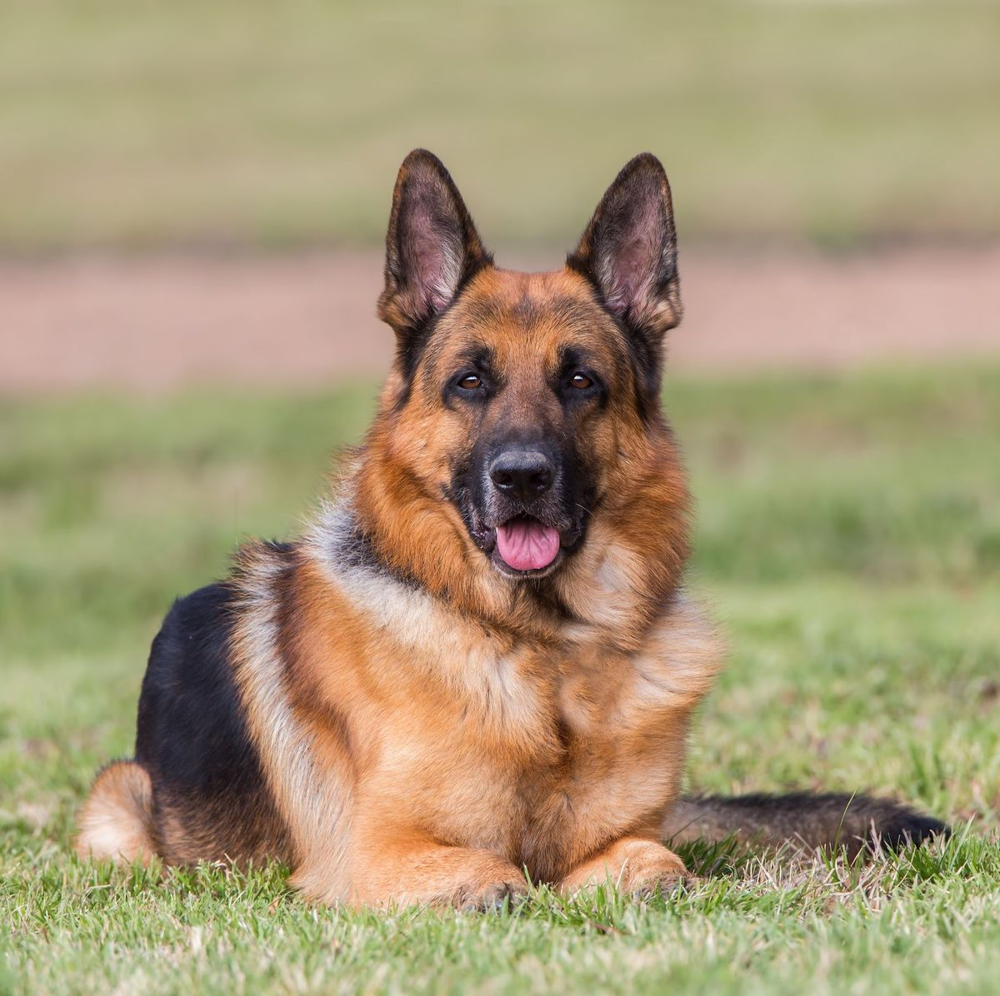


In order to visualize our breeds and make the model more user friendly, the following code loops all pictures inside our folder and displays the photo
and the predicted breed as title. The code also saves the picture in a folder called <code>results_inference</code>.


```python
def preprocess_and_predict(img_path, predictor):
    recomp = T.Compose([
        T.Resize(256),
        T.CenterCrop(224),
        T.ToTensor(),
        T.Normalize(
            mean=[0.485, 0.456, 0.406],
            std=[0.229, 0.224, 0.225]
        )])
    
    dog_pil = Image.open(img_path).convert('RGB') 
    image = recomp(dog_pil).unsqueeze(0)
    
    if image.size(1) != 3:
        raise ValueError(f"Unexpected number of channels: {image.size(1)}. Expected 3 channels.")
    
    response = predictor.predict(image.numpy())
    return response, dog_pil

# Loop
for img_path in image_paths:
    prediction, dog_image = preprocess_and_predict(img_path, predictor)
    
    predicted_index = np.argmax(prediction)
    breeds = list(unique_breeds)
    breeds = sorted(breeds)
    predicted_breed = breeds[predicted_index]
    name_breed = predicted_breed.split('.')[1]
    
    plt.imshow(dog_image)
    plt.title(f"Breed prediction: {name_breed}")
    plt.axis('off')
    
    img_name = os.path.basename(img_path) 
    save_path = os.path.join("results_inference", f"predicted_{name_breed}_{img_name}")
    plt.savefig(save_path, bbox_inches='tight', pad_inches=0.1)
    
    plt.show()

```


**OUTPUT**

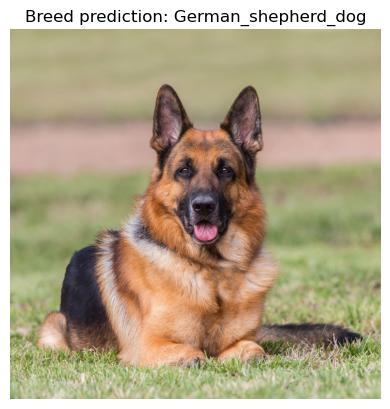

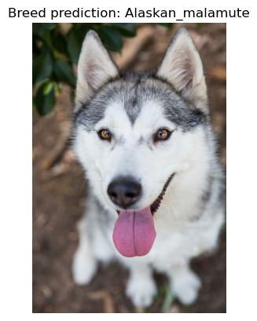

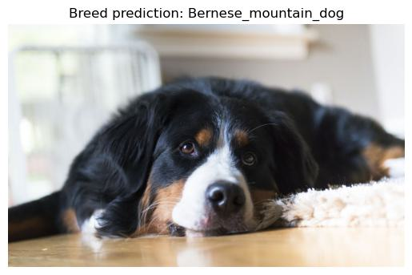

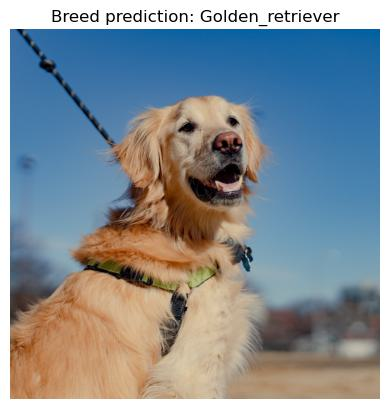


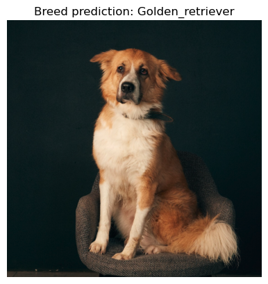

**This is my dog, she is not a goldie but she is a cutie**

